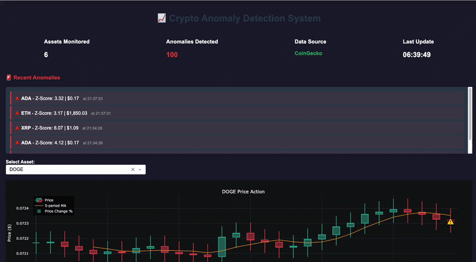
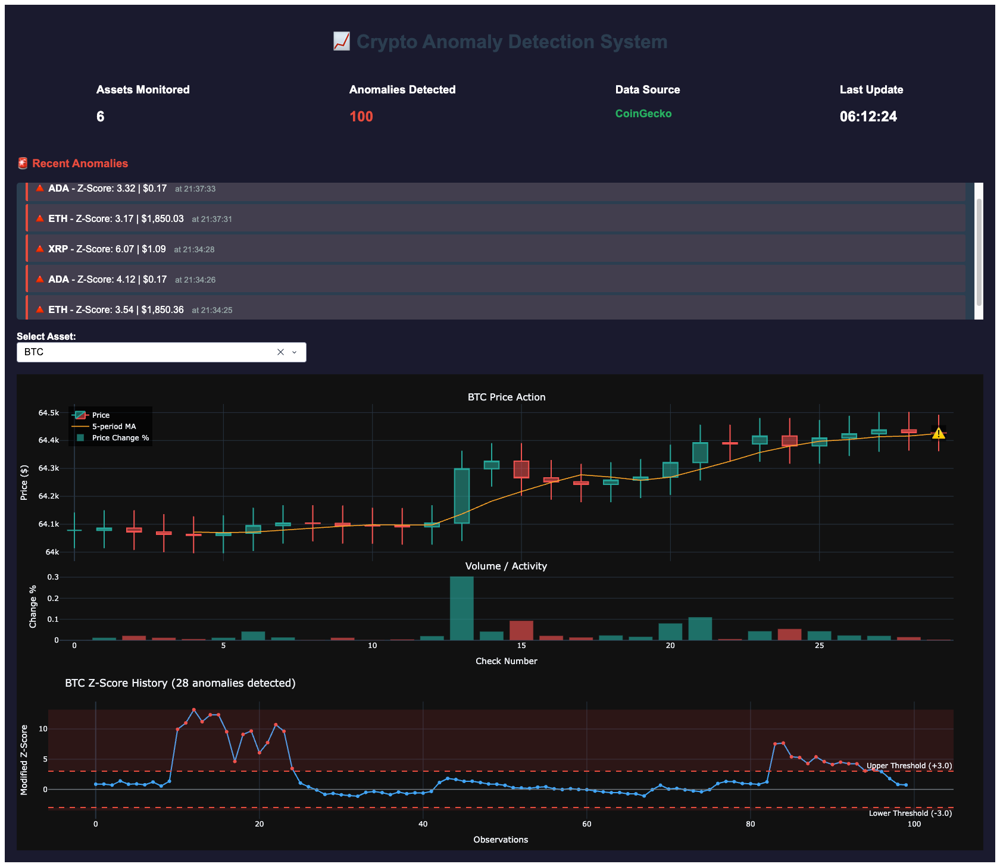
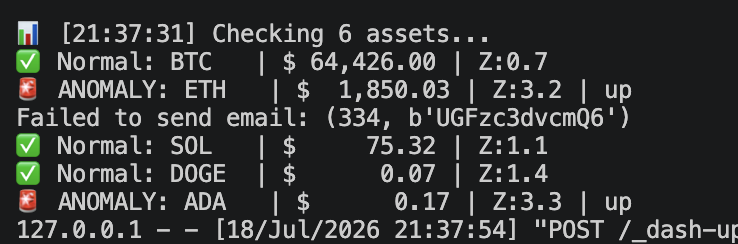
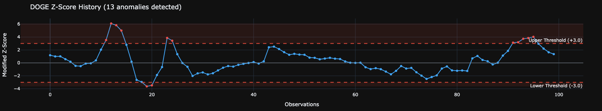

# 📈 Crypto Anomaly Detection & Trading Decision Platform

A production-grade market monitoring system that combines statistical anomaly detection with professional technical indicators to generate actionable trading signals. Not just alerts — confidence-scored recommendations backed by multiple indicators.

[](https://www.python.org/)
[](LICENSE)
[]()

<p align="center">
  
</p>

---

## 🎯 What This System Does

Most anomaly detection systems stop at "something unusual happened." This platform goes further:

| Stage | Question Answered | Method |
|-------|-------------------|--------|
| **Detect** | Is something unusual happening? | Modified Z-Score with adaptive thresholds |
| **Validate** | Is this real or noise? | Multi-factor confidence scoring (0-100%) |
| **Contextualize** | Is this coin-specific or market-wide? | Cross-asset correlation analysis |
| **Analyze** | What do indicators say? | RSI, MACD, Bollinger Bands |
| **Recommend** | What should I do? | Composite BUY/SELL/HOLD signals |

---

## 📸 Live Dashboard

<p align="center">
  
</p>

*Real-time monitoring dashboard showing candlestick charts, z-score tracking, and anomaly alerts with confidence scores.*

---

### Anomaly Detection in Action

<p align="center">
  
</p>

*Terminal output showing anomaly detection with confidence scoring, technical indicators, and actionable recommendations.*

---

### Z-Score Tracking

<p align="center">
  
</p>

*Modified Z-Score chart with adaptive threshold zones. Red dots indicate anomalies above threshold, blue dots show normal variation.*

---

### Dashboard Alert Cards

Each anomaly alert shows:
- 🔺/🔻 Direction indicator with price change %
- Z-Score and confidence percentage (color-coded)
- RSI, MACD, and composite indicator signal
- Specific action recommendation


┌──────────────────────────────────────────────────────┐
│ 🔺 BTC $68,234.50 +3.21% │
│ │
│ Z-Score: 5.2 Confidence: 85% | 14:32:15 │
│ │
│ 📊 Indicators: RSI: 72.3 MACD: 0.0234 Signal: SELL│
│ │
│ 🎯 RSI overbought + Bollinger sell — consider │
│ taking profits or tightening stop-loss │
└──────────────────────────────────────────────────────┘


**Color-Coded by Confidence:**
- 🔴 **Red border** = High confidence (80-100%) — Act immediately
- 🟠 **Orange border** = Medium confidence (50-79%) — Monitor closely
- 🔵 **Blue border** = Low confidence (<50%) — Wait for confirmation

---

## 🏗️ Architecture
┌─────────────────────────────────────────────────────────────────┐
│ DATA INGESTION │
│ ┌──────────────────┐ ┌──────────────────┐ │
│ │ CoinGecko API │ │ Yahoo Finance │ │
│ │ (Crypto) │ │ (Stocks) │ │
│ └────────┬─────────┘ └────────┬─────────┘ │
│ └────────────────┬───────────────┘ │
│ ▼ │
│ ┌─────────────────────────────────────────────────────────┐ │
│ │ ANOMALY DETECTION ENGINE │ │
│ │ • Modified Z-Score (Median Absolute Deviation) │ │
│ │ • Adaptive thresholds per asset (BTC:2.5, DOGE:4.5) │ │
│ │ • Rolling window baseline (30 periods) │ │
│ └────────────────────────┬────────────────────────────────┘ │
│ ▼ │
│ ┌─────────────────────────────────────────────────────────┐ │
│ │ CONFIDENCE SCORING LAYER │ │
│ │ • Z-Score magnitude (how extreme?) │ │
│ │ • Market divergence (moving against the crowd?) │ │
│ │ • Price change % (how big is the move?) │ │
│ │ → Output: 0-100% confidence score │ │
│ └────────────────────────┬────────────────────────────────┘ │
│ ▼ │
│ ┌─────────────────────────────────────────────────────────┐ │
│ │ TECHNICAL INDICATORS ENGINE │ │
│ │ • RSI (Relative Strength Index) — Overbought/Oversold │ │
│ │ • MACD — Trend direction & momentum │ │
│ │ • Bollinger Bands — Price extremes │ │
│ │ • Volume Spike Detection — Confirmation strength │ │
│ │ → Output: Composite BUY/SELL/HOLD signal │ │
│ └────────────────────────┬────────────────────────────────┘ │
│ ▼ │
│ ┌─────────────────────────────────────────────────────────┐ │
│ │ DECISION SUPPORT LAYER │ │
│ │ • Combines anomaly + indicators + market context │ │
│ │ • Generates specific action recommendations │ │
│ │ • Fetches relevant news headlines │ │
│ └────────────┬───────────────────┬────────────────────────┘ │
│ ▼ ▼ │
│ ┌─────────────────┐ ┌──────────────────┐ │
│ │ Dashboard │ │ Alert System │ │
│ │ (Plotly/Dash) │ │ (Email + Slack) │ │
│ └─────────────────┘ └──────────────────┘ │
└─────────────────────────────────────────────────────────────────┘


---

## 🧠 How Detection Works

### Modified Z-Score Formula
Z = 0.6745 × (x - median) / MAD

Where:
x = current price
median = middle value of last 30 observations
MAD = Median Absolute Deviation
0.6745 = scaling factor for normal distribution


### Why Modified Z-Score?

| Method | Central Tendency | Spread Measure | Outlier Robust? |
|--------|-----------------|----------------|-----------------|
| Standard Z-Score | Mean | Std Deviation | ❌ Sensitive to outliers |
| **Modified Z-Score** | **Median** | **MAD** | **✅ Robust** |

The key insight: standard deviation gets corrupted by the very outliers you're trying to detect. MAD stays stable.

### Confidence Scoring (0-100%)
Confidence = Base(40%)
  - Z-Score strength (up to +30%) // How extreme?
  - Market divergence (up to +25%) // Against the crowd?
  - Price magnitude (up to +15%) // How big?

Example:
BTC Z-Score: 5.2 (+30%) ← Very extreme
Market: bearish, BTC: up (+25%) ← Going against market
Price change: +4.8% (+15%) ← Big move
→ Confidence: 95% ← Very likely a real event


### Technical Indicators

| Indicator | What It Measures | Signal |
|-----------|-----------------|--------|
| **RSI (14)** | Overbought/Oversold | >70 = SELL, <30 = BUY |
| **MACD (12,26,9)** | Trend + Momentum | Crossover = BUY/SELL |
| **Bollinger Bands (20,2)** | Price extremes | Outside bands = reversal likely |
| **Volume Spike** | Confirmation | 3x avg = strong confirmation |

---

## 🚀 Quick Start

### Prerequisites
- Python 3.8+
- Gmail account (for alerts)

### Installation

```bash
# Clone
git clone https://github.com/YOUR_USERNAME/stock-anomaly-detection.git
cd stock-anomaly-detection

# Virtual environment
python -m venv venv
source venv/bin/activate  # Windows: venv\Scripts\activate

# Install
pip install -r requirements.txt

# Configure
cp .env.example .env
# Edit .env with your email credentials


Configuration
Open src/config.py:
# Choose market:
DATA_SOURCE = "coingecko"  # Crypto (24/7)
# DATA_SOURCE = "yahoo"    # Stocks (market hours)

# Adjust sensitivity per asset:
COINGECKO_CONFIG = {
    "adaptive_thresholds": {
        "BTC": 2.5,   # Less volatile
        "ETH": 3.0,   # Medium
        "DOGE": 4.5,  # Very volatile
    }
}


📁 Project Structure
stock_anomaly_detection/
├── src/
│   ├── data_sources/           # Pluggable data providers
│   │   ├── yahoo_finance.py    # Stock market (Yahoo Finance)
│   │   └── coingecko.py        # Cryptocurrency (CoinGecko)
│   ├── anomaly_detector.py     # Z-Score + confidence engine
│   ├── indicators.py           # RSI, MACD, Bollinger Bands
│   ├── news_fetcher.py         # CryptoPanic news integration
│   ├── dashboard.py            # Plotly/Dash live dashboard
│   ├── alerting.py             # Email + Slack notifications
│   ├── config.py               # All settings in one place
│   └── main.py                 # Application entry point
├── assets/
│   ├── dashboard_demo.gif      # Live demo recording
│   ├── dashboard_overview.png  # Full dashboard screenshot
│   ├── terminal_output.png     # Anomaly detection output
│   └── zscore_chart.png        # Z-Score tracking chart
├── notebooks/
│   └── anomaly_analysis.ipynb  # Jupyter analysis
├── requirements.txt
└── README.md


📈 Sample Output
Terminal

==============================================================
📊 [14:32:15] Checking 6 assets
==============================================================

🚨 ANOMALY: BTC | $68,234.50 | +3.21%
   Z-Score: 5.2 | Direction: up
   Confidence: [████████░░] 85%
   Market: mixed
   📊 RSI: 72.3 | MACD: 0.0234 | Signal: SELL (72.0%)
      Reasons: RSI=72.3 (SELL) | MACD=0.0234 (BUY) | BB Overbought
   🎯 Action: RSI overbought — consider taking profits
   📰 Recent News:
      • Bitcoin ETF inflows reach monthly high
      • Fed signals potential rate cut

✅ ETH    | $3,876.45  | Z:1.23   | RSI:54.2
✅ SOL    | $156.78    | Z:-0.87  | RSI:48.9

_________________________________________________________________________
🎯 Use Cases
Day Traders: Identify high-confidence entry/exit points

Portfolio Managers: Monitor for unusual market events

Risk Analysts: Detect anomalies before they become problems

Crypto Enthusiasts: Understand WHY the market is moving

_________________________________________________________________________

⚠️ Limitations & Disclaimer
Not financial advice — This is a decision support tool, not a trading bot

Free API constraints — CoinGecko rate limits may cause delays

Statistical limitations — No model predicts markets with certainty

Confidence ≠ Guarantee — High confidence anomalies can still be noise

Past performance ≠ Future results — Technical indicators are probabilistic

__________________________________________________________________________


